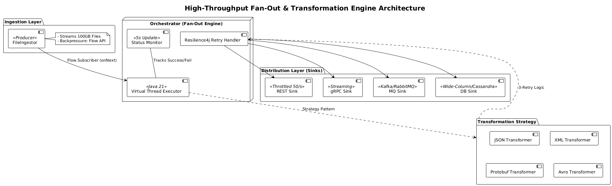

# Distributed Data Fan-Out & Transformation Engine

A high-throughput distributed fan-out engine built in Java 21 that ingests large files (up to 100GB), transforms each record into multiple formats, and concurrently distributes the transformed data to multiple sinks. The system is designed to run in resource-constrained environments while maintaining backpressure and ensuring every record is accounted for.

---

## 1. Setup Instructions

### Prerequisites

- Java 21 (required for Virtual Threads)
- Maven 3.8+
- Docker & Docker Compose (optional, for containerized execution)

---

### Local Execution

Clone the repository:

```bash
git clone <your-repo-url>
cd high-throughput-fan-out-engine
```

Build the project:

```bash
mvn clean install
```

Run the application:

```bash
mvn exec:java -Dexec.mainClass="com.engine.App"
```

Run tests:

```bash
mvn test
```

---

### Docker Execution

To run the engine in a resource-constrained environment (512MB RAM), as per the non-functional requirements:

```bash
docker-compose up --build
```

---

## 2. Architecture Diagram (Text Description)



---

## 3. Design Decisions

### Concurrency Model: Java 21 Virtual Threads

The engine uses Java 21 Virtual Threads via:

```java
Executors.newVirtualThreadPerTaskExecutor()
```

This allows the system to scale efficiently with CPU cores. Since sinks simulate I/O-bound work (network latency), virtual threads enable thousands of concurrent "network calls" without the heavy overhead of OS-level platform threads.

---

### Backpressure: Java Flow API

To meet the 100GB file requirement without an Out-Of-Memory (OOM) failure, the engine uses the Java Flow API.

- The `FanOutEngine` acts as a `Subscriber`
- It calls:

```java
subscription.request(1)
```

only after it has successfully dispatched the current record to the internal executor.

This ensures the Producer (`FileIngestor`) never reads faster than the sinks can consume, providing true streaming backpressure.

---

### Resilience: Resilience4j Retries

To ensure zero data loss, every sink call is wrapped using Resilience4j Retry.

- Max retries: 3 attempts per record
- Accounting: A 5-second status update reports successes vs. failures so every record is tracked

This ensures every record is either delivered or explicitly marked as failed after exhausting retry attempts.

---

## 4. Assumptions

### Data Format
Input files are assumed to be either:
- `.jsonl` (one JSON record per line)
- `.csv` (one record per line)

Each line represents a single discrete record.

---

### Network Conditions
Mock sinks simulate stable but latent network conditions (10ms–100ms delay).

For real production deployments, retry wait durations and failure handling should be tuned based on actual network and service SLAs.

---

### Memory
It is assumed the runtime environment provides at least 512MB of RAM for:
- JVM overhead
- internal buffering
- Virtual Thread scheduling overhead

---

## 5. Prompts Log

All prompts used during the AI-assisted development of this project are documented in the mandatory log file:

- `src/docs/prompts.txt`
